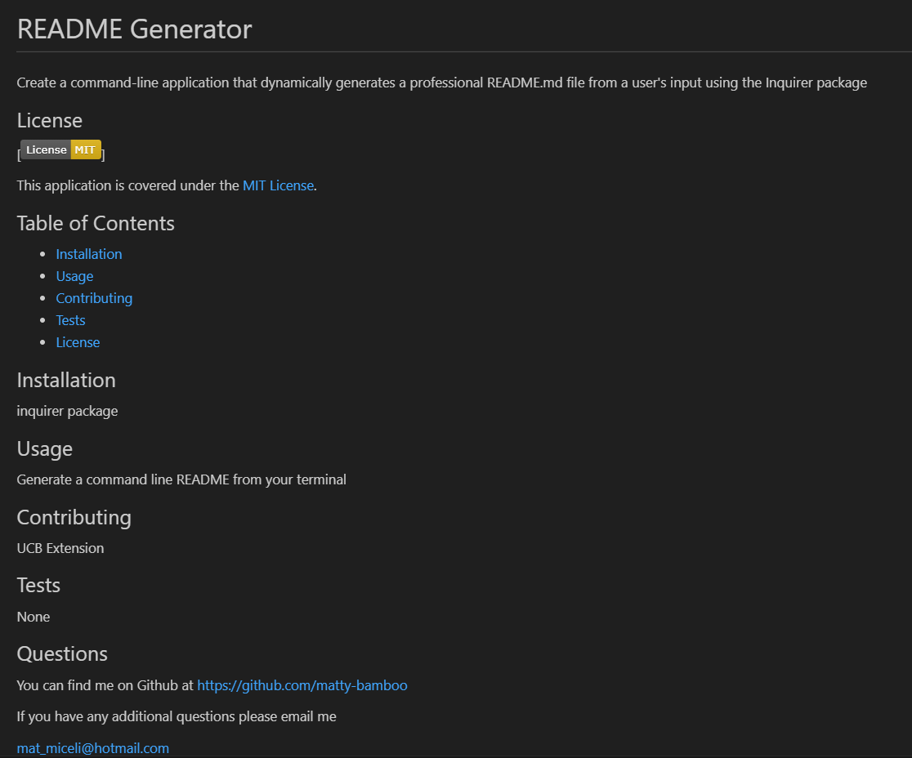

# README Generator  

## Description
Readme Generator using node.js

## Table of Contents
- [Mock-Up](#mock-up)
- [Technologies](#technologies)
- [Credits](#credits)
- [License](#license)

## Mock-up

README Generator creates a professional README using node.js

## Technologies
- [node.js](https://nodejs.org/en): version 18.16
- [nmp inquirer 8.2.4](https://www.npmjs.com/package/inquirer/v/8.2.4): version8.2.4

## Credits

Starter code from homework-challenge-09 and additional starter code from Samantha Randolph, course instructor for the codeing bootcamp.

## License
README Generator is licensed under the MIT license